# Sun Of Bun - Introduction.

Project milestone 4 for Code Institute Full-stack development program.
This project is a Full Stack website built using the Django framework.Sun Of A Bun is a restraurant based website where you can view the menu and register and acciount and book a table and send an email.You can also edit and delete the booking if needed.

[Live Project Here](https://pp4-restaurant-django.herokuapp.com/)

## User Experience - UX

### User Stories

* As a website user, I can:

1. Navigate around the site and easily view the desired content.
2. View the menu on the site
3. Register for an account to avail of the services offered to members.
4. View the contact us form.

* As logged in website user, I can:

1. I can go to the booking page and see my list of bookings.
2. I can create a new booking
3. I can edit my booking
4. I can cancel my booking

* As a website superuser, I can:

1. Create new groups
2. Create new users or edit existing users.
3. Create new bookings or edit or change the existing bookings.
4. Create new menu items or edit the current ones.
5. Create some websites.
6. Create social accounts

### Agile Methodology

All functionality and development of this project were managed using GitHub which Projects can be found
[here](https://github.com/users/TheDKnight/projects/4)

### The Scope

#### Main Site Goals

* To provide users with a good experience when using the restaurant website.
* To provide users with a visually pleasing website that is intuitive to use and easy to navigate.
* To provide a website with a clear purpose.
* To provide role-based permissions that allows user to interact with the website.
* To provide tools that allow users to create a booking and edit or cancel.

## Features

### Home Page

This is the home page as you enter the webite.The header allows you to navigate the website or register or login.

### Menu Page

This is the menu page where the users can see what options are offered.

### Contact Us Page

This is the contact us page where the users can send an email with any query or question they may have.

### Booking Page When Not Logged In

This is what the booking page looks when the user is not logged in, they need to register or log in to make or view there bookings.

### Booking Page When Logged In

When the user is logged in when viewing the booking page, they can edit or cancel there current bookings or make a new.

### Admin Panel

This is the view of the admin panel.

### Admin Panel Menu

This is the admin menu page where the admin can add new menu items or edit or delete the current ones.

### Admin Panel Booking

This is the admin booking page when the admin can see current bookings and edit or cancel or add a new booking.

## Testing

### Responsiveness

### Ipad Air

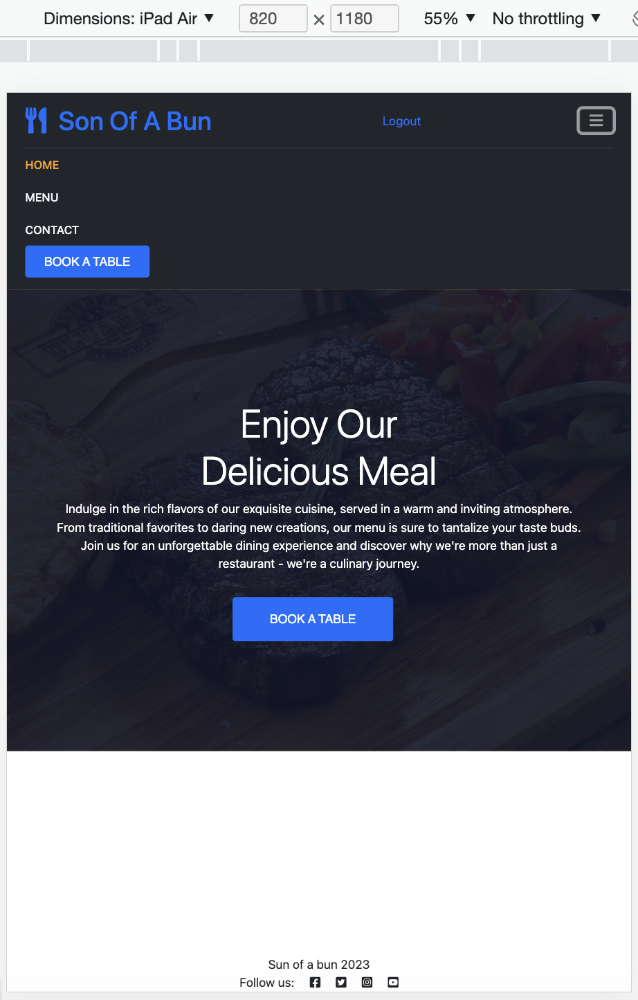

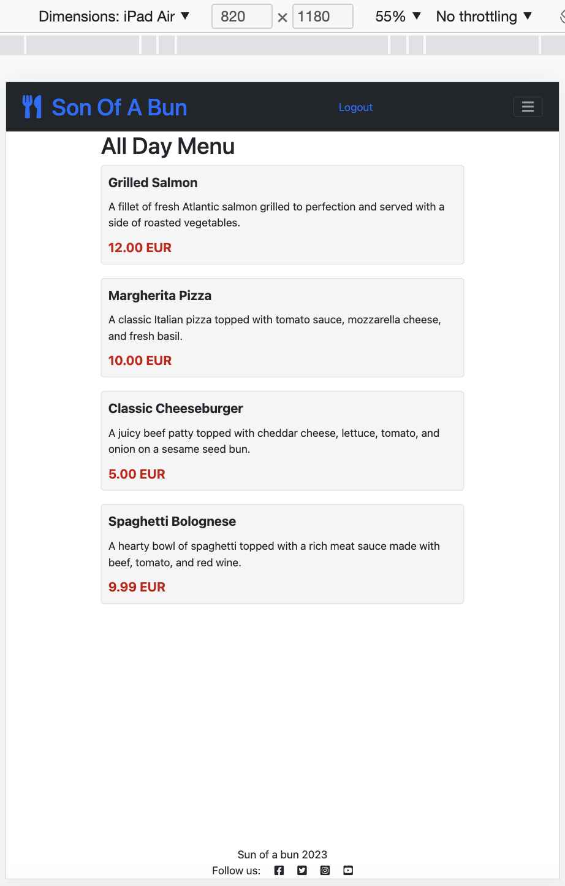

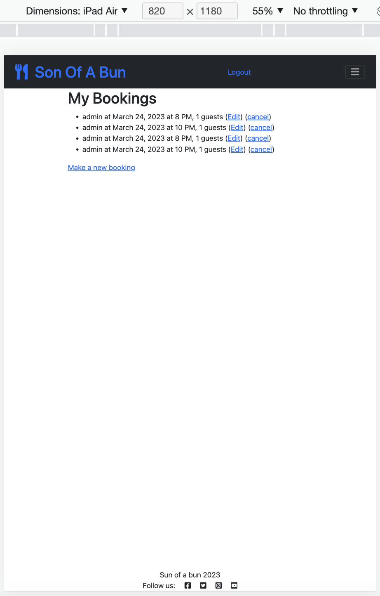

### Iphone 12

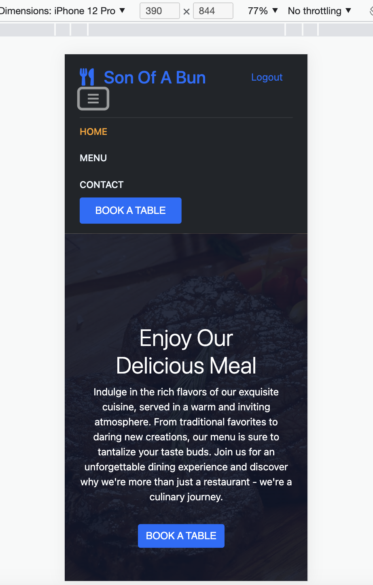

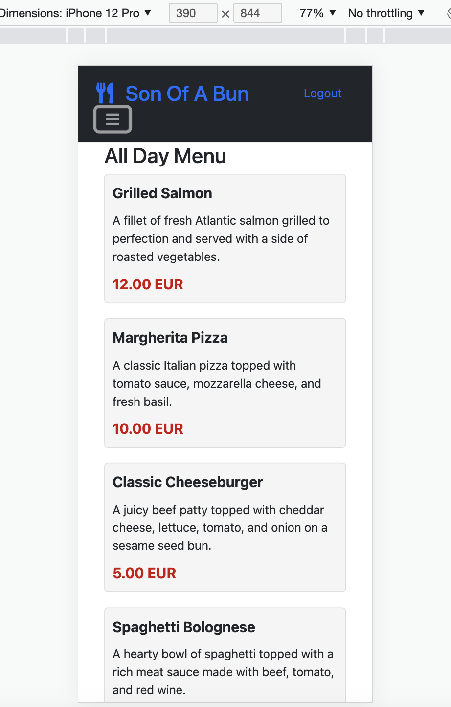

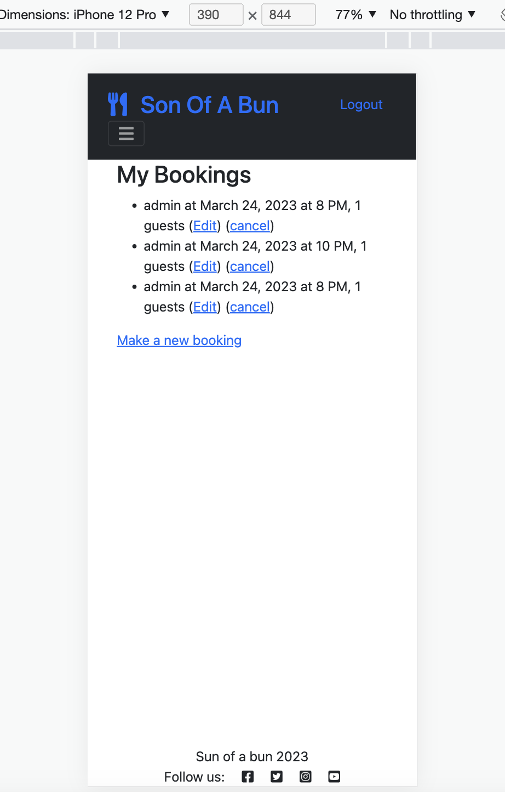

## Browser Compatibility

Tested the website in chrome and safari and the website work as expected in both browsers with no errors.

## Bugs

One bug i did have was in the models file where i was returning an item that didnt exist. 

def __str__(self):
        return self.title.

def __str__(self):
        return f' USER: {self.user} DATE: {self.day} TIME: {self.time} GUESTS: {self.guests}'

I was returning self.title even tho there was no self.title and it was giving a 500 error.

## Lighthouse Test/ Pagespeed

### Desktop

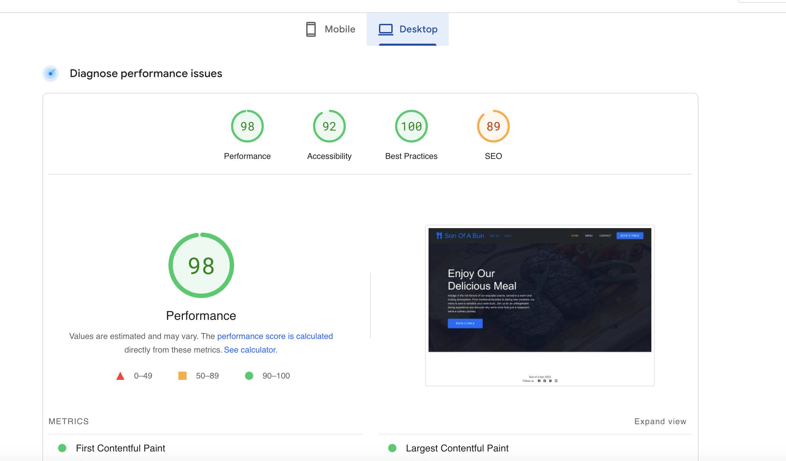
 

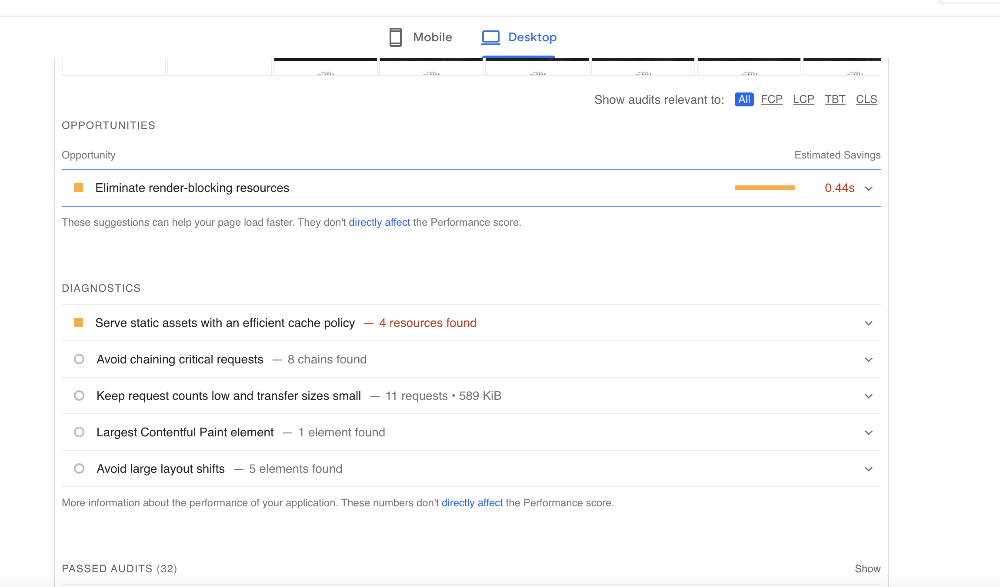

### Mobile

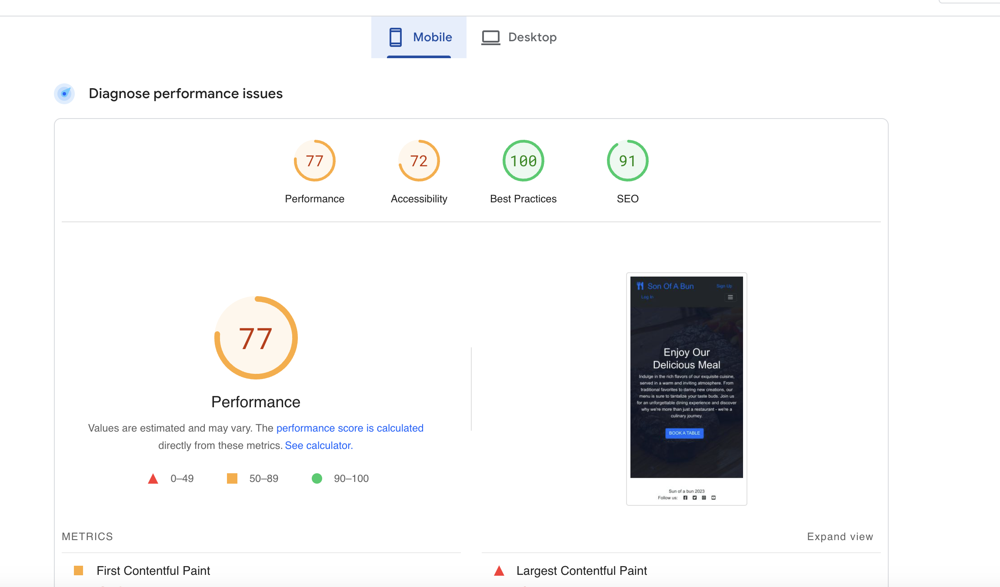
 

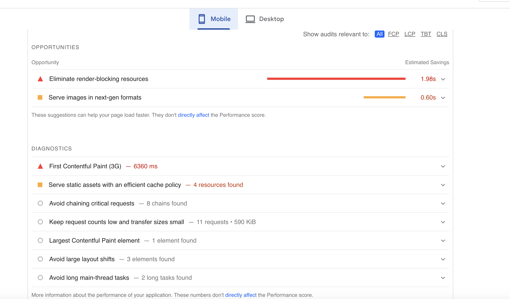

## Html

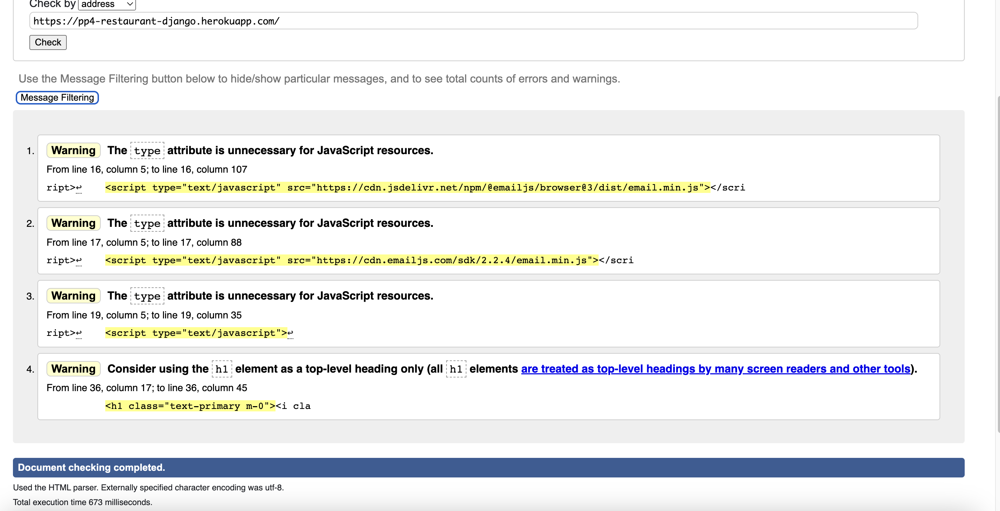
 

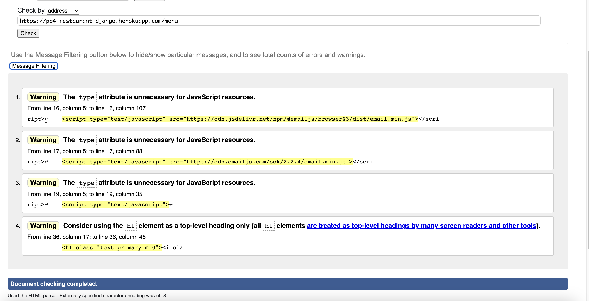

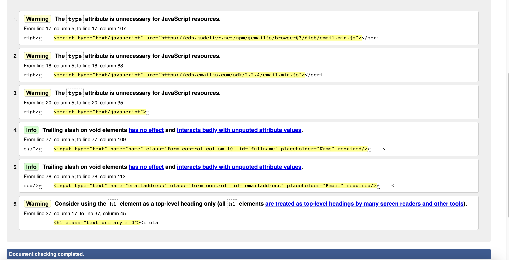
 

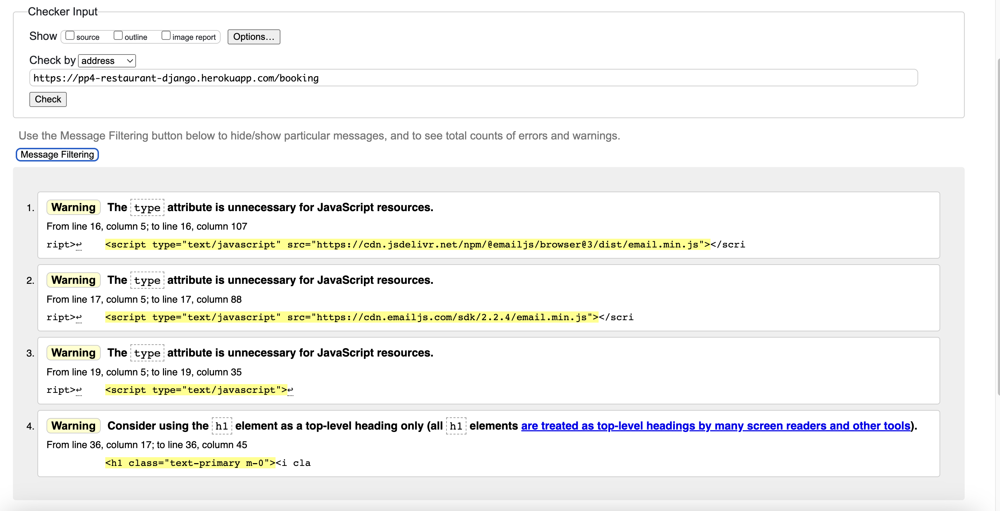

## CSS

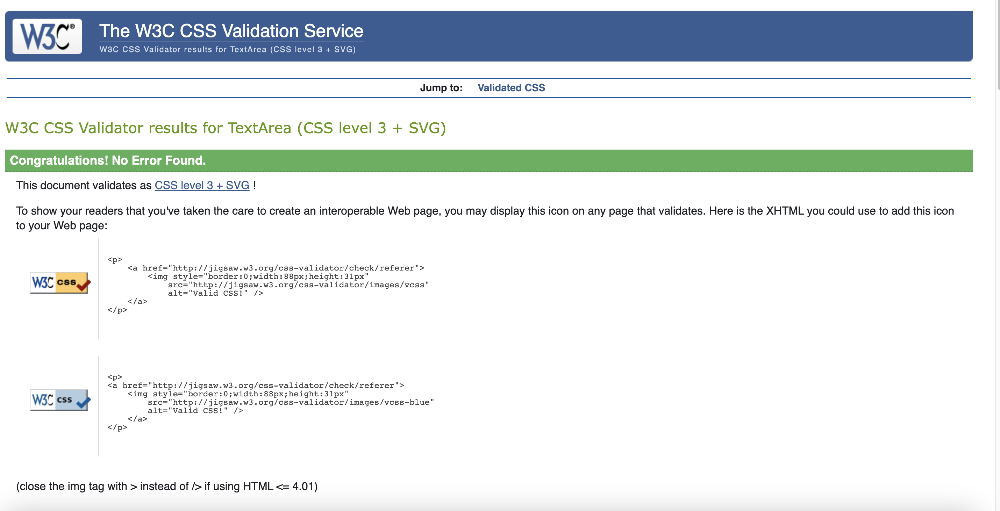

## PEP8

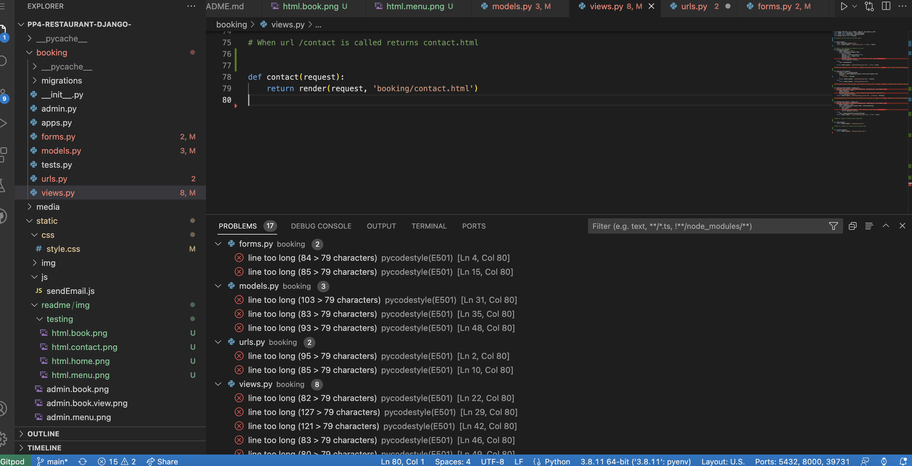

The only errors for pep8 are lines to long.

## Creating the Django app

1. Go to the Code Institute Gitpod Full Template [Template](https://github.com/Code-Institute-Org/gitpod-full-template)
2. Click on Use This Template
3. Once the template is available in your repository click on Gitpod
4. When the image for the template and the Gitpod are ready open a new terminal to start a new Django App
5. Install Django and gunicorn: `pip3 install django gunicorn`
6. Install supporting database libraries dj_database_url and psycopg2 library: `pip3 install dj_database_url psycopg2`
7. Create file for requirements: in the terminal window type `pip freeze --local > requirements.txt`
8. Create project: in the terminal window type django-admin startproject your_project_name
9. Create app: in the terminal window type python3 manage.py startapp your_app_name
10. Add app to the list of installed apps in settings.py file: you_app_name
11. Migrate changes: in the terminal window type python3 manage.py migrate
12. Run the server to test if the app is installed, in the terminal window type python3 manage.py runserver
13. If the app has been installed correctly the window will display The install worked successfully! Congratulations!

## Deployment of This Project

* This site was deployed by completing the following steps:

1. Log in to [Heroku](https://id.heroku.com) or create an account
2. On the main page click the button labelled New in the top right corner and from the drop-down menu select Create New
App
3. You must enter a unique app name
4. Next select your region
5. Click on the Create App button
6. Click in resources and select Heroku Postgres database
7. Click Reveal Config Vars and add a new record with SECRET_KEY
8. Click Reveal Config Vars and add a new record with the `CLOUDINARY_URL`
9. Click Reveal Config Vars and add a new record with the `DISABLE_COLLECTSTATIC = 1`
10. The next page is the project’s Deploy Tab. Click on the Settings Tab and scroll down to Config Vars
11. Next, scroll down to the Buildpack section click Add Buildpack select python and click Save Changes
12. Scroll to the top of the page and choose the Deploy tab
13. Select Github as the deployment method
14. Confirm you want to connect to GitHub
15. Search for the repository name and click the connect button
16. Scroll to the bottom of the deploy page and select the preferred deployment type
17. Click either Enable Automatic Deploys for automatic deployment when you push updates to Github

## Final Deployment 

1. Create a runtime.txt `python-3.11`
2. Create a Procfile `web: gunicorn your_project_name.wsgi`
3. When development is complete change the debug setting to: `DEBUG = False` in settings.py
4. In Heroku settings, delete the config vars for `DISABLE_COLLECTSTATIC = 1`

## Credits

### Information Sources / Resources

* [W3Schools - Python](https://www.w3schools.com/python/)
* [Django - Python](https://docs.djangoproject.com/)
* [Code Institute - Sample Django Project ](https://codeinstitute.net/)