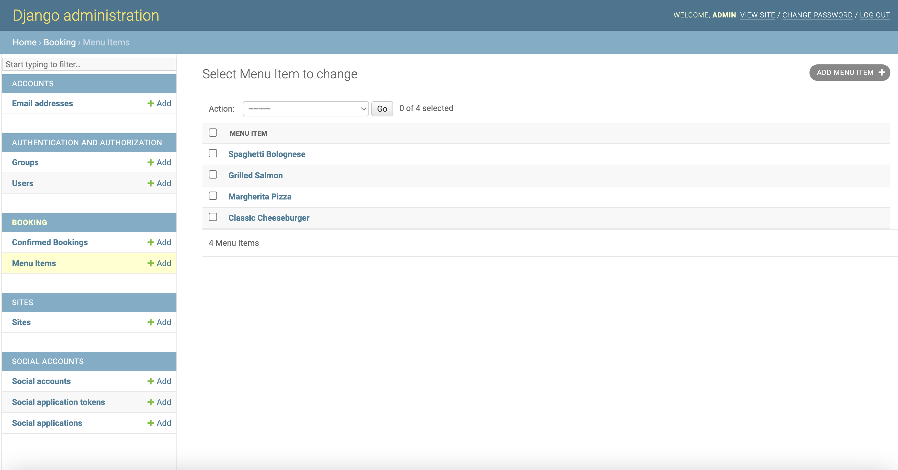

# Sun Of Bun - Introduction.

Project milestone 4 for Code Institute Full-stack development program.
This project is a Full Stack website built using the Django framework.Sun Of A Bun is a restraurant based website where you can view the menu and register and acciount and book a table and send an email.You can also edit and delete the booking if needed.

[Live Project Here](https://pp4-restaurant-django.herokuapp.com/)

## User Experience - UX

### User Stories

* As a website user, I can:

1. Navigate around the site and easily view the desired content.
2. View the menu on the site
3. Register for an account to avail of the services offered to members.
4. View the contact us form.

* As logged in website user, I can:

1. I can go to the booking page and see my list of bookings.
2. I can create a new booking
3. I can edit my booking
4. I can cancel my booking

* As a website superuser, I can:

1. Create new groups
2. Create new users or edit existing users.
3. Create new bookings or edit or change the existing bookings.
4. Create new menu items or edit the current ones.
5. Create some websites.
6. Create social accounts

### Agile Methodology

All functionality and development of this project were managed using GitHub which Projects can be found
[here](https://github.com/users/TheDKnight/projects/4)

### The Scope

#### Main Site Goals

* To provide users with a good experience when using the restaurant website.
* To provide users with a visually pleasing website that is intuitive to use and easy to navigate.
* To provide a website with a clear purpose.
* To provide role-based permissions that allows user to interact with the website.
* To provide tools that allow users to create a booking and edit or cancel.

## Features

### Home Page

This is the home page as you enter the webite.The header allows you to navigate the website or register or login.

### Menu Page

This is the menu page where the users can see what options are offered.

### Contact Us Page

This is the contact us page where the users can send an email with any query or question they may have.

### Booking Page When Not Logged In

This is what the booking page looks when the user is not logged in, they need to register or log in to make or view there bookings.

### Booking Page When Logged In

When the user is logged in when viewing the booking page, they can edit or cancel there current bookings or make a new.

### Admin Panel

This is the view of the admin panel.

### Admin Panel Menu

This is the admin menu page where the admin can add new menu items or edit or delete the current ones.

### Admin Panel Booking

This is the admin booking page when the admin can see current bookings and edit or cancel or add a new booking.

## Testing